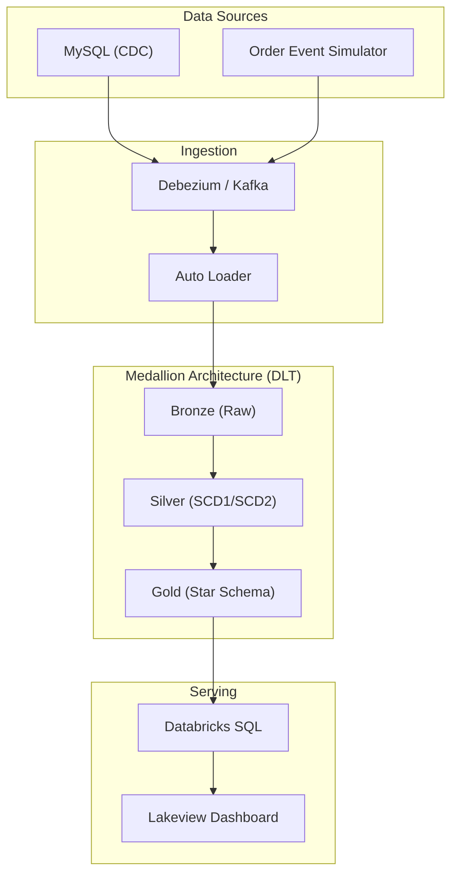

# Databricks Real-Time Retail Lakehouse with CDC

> **An end-to-end production Lakehouse** combining real-time e-commerce streaming with CDC pipelines via Delta Live Tables.

## Architecture



## Features
- Real-time ingestion via Auto Loader / Kafka
- Medallion architecture (Bronze, Silver, Gold) with DLT
- Slowly Changing Dimensions (SCD Type 1 & 2) via `APPLY CHANGES`
- Unity Catalog governance (RLS, Masking, Tags)
- Orchestration via Databricks Asset Bundles (DABs)

## Setup (Local Development)

1. Clone the repository
2. Install dependencies: `pip install -r requirements.txt`
3. Generate sample data: 
   ```bash
   python src/generators/order_event_producer.py
   python src/generators/mysql_cdc_producer.py
   ```
4. Deploy bundle (if connected to workspace): `databricks bundle deploy -t dev`

---
## Phase 1: Setup + Bronze Layer
- Data Generators (Faker) for Orders and Debezium CDC (Customers/Products)
- Auto Loader (cloudFiles) for resilient ingestion
- Unity Catalog scaffolding

## Phase 2: Silver Layer + CDC + SCD2
- `dlt.apply_changes()` for SCD Type 2 (Customers) and SCD Type 1 (Products)
- Late-arriving duplicate handling via Watermarking
- Data Quality Expectations (`expect_or_drop`, `expect_or_fail`)

## Phase 3: Gold Layer + Star Schema
- Conformed dimensional model (Fact/Dim tables)
- Optimized with Z-Ordering on surrogate keys
- Real-time aggregation using Structured Streaming `window`

## Phase 4: Dashboard & Governance
- Lakeview Dashboard definition (JSON) + SQL Queries
- Column Masking for PII (Email, Phone)
- Row-Level Security (RLS) by Region
- Asset Bundle CI/CD via GitHub Actions

---

## 📸 Screenshots
*(Add screenshots of your Databricks SQL Dashboard and DLT DAG here)*
- ``
- ``

---

## 🧠 What I Learned
- **DLT `apply_changes`**: Simplified complex SCD2 MERGE statements into a declarative Python API.
- **Unity Catalog**: Managing governance at the metastore level rather than table-level ACLs is incredibly powerful for scaling teams.
- **Asset Bundles (DABs)**: Transitioning from Terraform to DABs reduced pipeline deployment boilerplate significantly.

## 🚀 Future Improvements
- Replace Auto Loader fallback with native Kafka/Event Hubs streaming on a premium cluster.
- Add Serverless DLT compute to reduce startup times.
- Integrate Great Expectations for advanced data quality profiling.

---

## 💼 Resume Bullets
*Choose the one that best fits your resume format:*

**Short:**
- Built an end-to-end real-time Lakehouse on Azure Databricks using Delta Live Tables, Auto Loader, and Unity Catalog, reducing CDC pipeline complexity by utilizing the declarative `apply_changes` API for SCD Type 2 tracking.

**Medium:**
- Engineered a Medallion architecture streaming Lakehouse on Azure Databricks, ingesting 10K+ simulated events/min via Auto Loader.
- Implemented declarative SCD Type 2 pipelines using Delta Live Tables and governed PII data using Unity Catalog Column Masking and RLS.
- Orchestrated full CI/CD deployment using Databricks Asset Bundles and GitHub Actions, delivering real-time KPIs to Lakeview Dashboards.

**Detailed (Metrics-focused):**
- **Architecture**: Designed a real-time retail Lakehouse on Azure Databricks processing multi-stream JSON data (Orders, MySQL CDC) into a Gold-tier star schema.
- **Data Engineering**: Replaced manual `MERGE` logic with DLT `apply_changes`, automatically handling late-arriving CDC updates and maintaining SCD Type 2 history.
- **Governance & CI/CD**: Secured PII with Unity Catalog column masking and automated deployments across Dev/Prod environments using Databricks Asset Bundles (DABs).

---

## 🌐 LinkedIn Post
Excited to share my latest Data Engineering project: **Databricks Real-Time Retail Lakehouse with CDC**! 🚀

I built an end-to-end streaming pipeline that combines high-velocity order events with Debezium CDC updates from a MySQL database.

**Key Highlights:**
🔹 **Delta Live Tables**: Used the declarative `apply_changes` API to seamlessly handle SCD Type 2 for customer history—no complex MERGE statements required!
🔹 **Unity Catalog**: Secured the Gold layer with Column Masking for PII and Row-Level Security (RLS).
🔹 **Databricks Asset Bundles**: Fully automated deployment across environments via GitHub Actions.
🔹 **Lakeview Dashboards**: Served real-time windowed KPIs to business users.

Check out the full code and architecture in my GitHub repo! 👇

#Databricks #DataEngineering #DeltaLake #DLT #PySpark #UnityCatalog #CDC #SCD2
