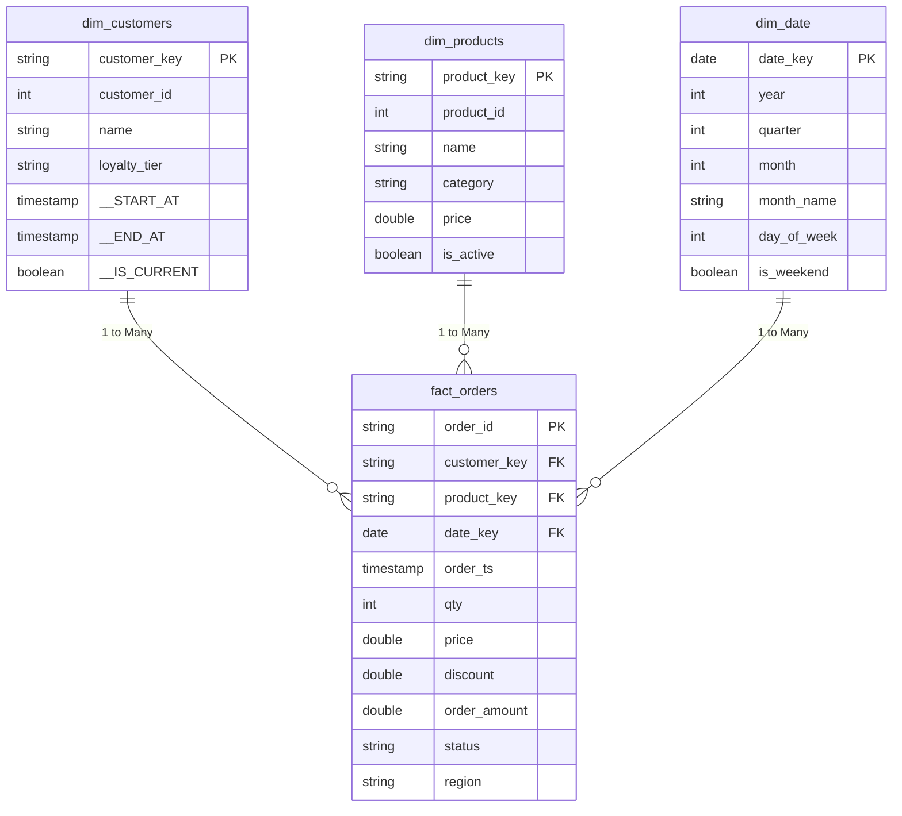

# Star Schema Design

This document visualizes the dimensional modeling applied in the Gold layer of the Databricks Real-Time Retail Lakehouse with CDC.

## Diagram

## Optimization Strategy

- **`fact_orders`**: Partitioned by `order_date` (efficient for time-series queries). Z-Ordered by `customer_key` and `product_key` to skip data effectively during slice-and-dice aggregations.
- **Dimensions**: Small enough that partitioning is anti-pattern. Auto compaction is enabled.
